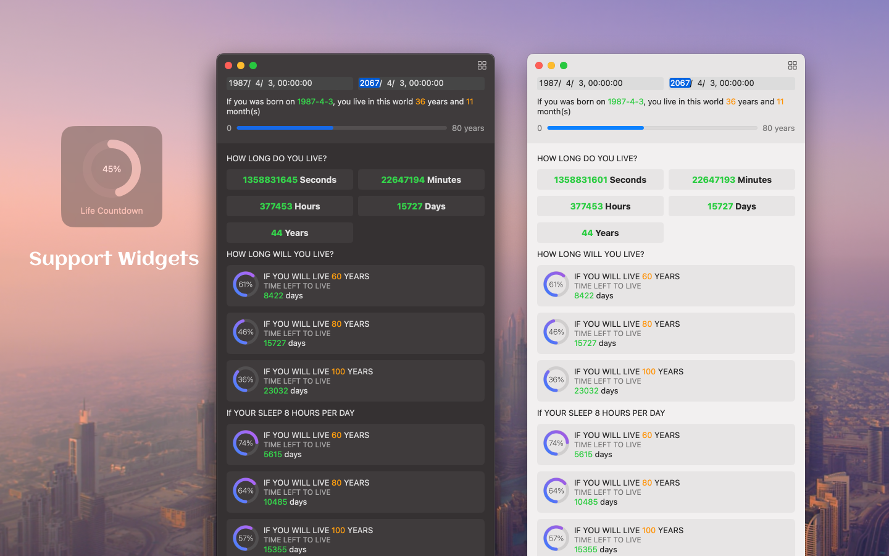
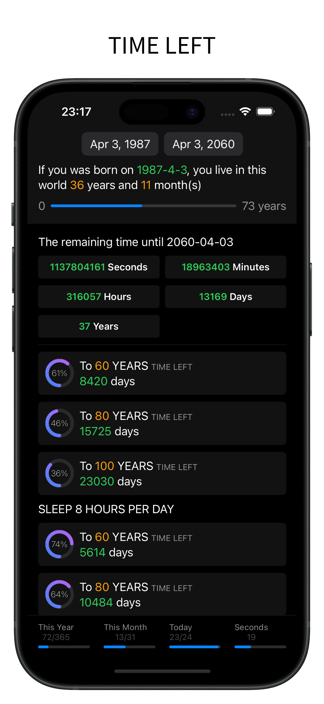
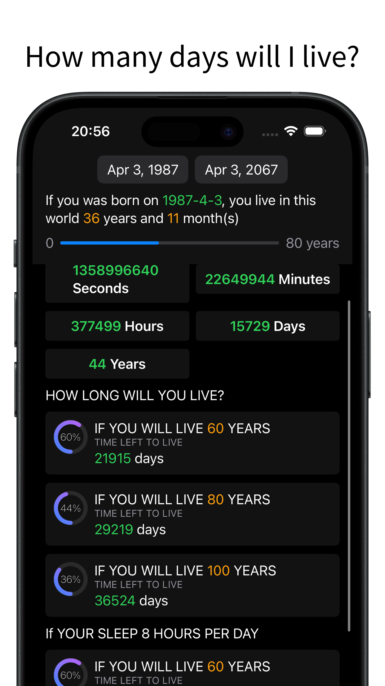

	 
	 
	
	<h1>Time Passage</h1>
  <!--rehype:style=border: 0;-->
	

		<a href="./README.zh.md">中文</a> • 
		<a href="./privacy-policy.md">Privacy Policy</a> • 
		<a href="https://wangchujiang.com/#/contact">Contact & Support</a>
	

	

		
		
	

Calculate how much time is left from the birthday to the given time. "(The iOS reviewer asked me to change the name ~~`Life Countdown Time`~~ to `Time Passage`.)"

When will i die? 

